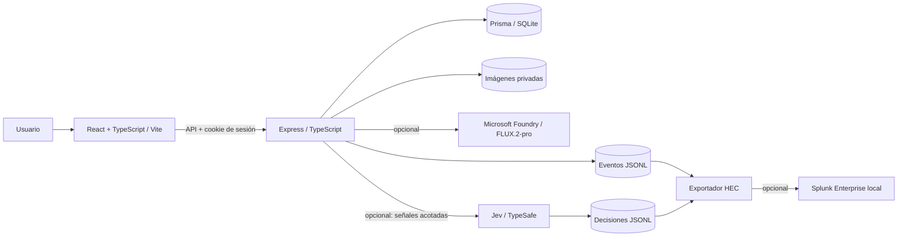

# Adaptive Security Orchestrator

Laboratorio full stack de creación de imágenes y seguridad adaptativa. Combina una aplicación React/TypeScript con una API Express, persistencia SQLite mediante Prisma, generación opcional con FLUX.2-pro en Microsoft Foundry, telemetría local, análisis opcional con Jev y exportación opcional a Splunk Enterprise. Está diseñado para ejecutarse y evaluarse en una máquina local.

## Qué demuestra el proyecto

| Área | Implementación verificable |
| --- | --- |
| Producto | Catálogo público, registro e inicio de sesión, generación de imágenes, carga de archivos, biblioteca privada y editor en el navegador. |
| Acceso | Sesiones mediante cookies, token CSRF para cambios de estado, rutas privadas en la interfaz y comprobación de autorización en la API. |
| Protección de recursos | Autenticación antes de procesar archivos multipart, límites de tamaño y partes, validación de imágenes, cuota horaria de generación y límites de intentos de acceso. |
| Observabilidad | `X-Request-ID` y eventos JSONL sin credenciales, prompts ni contenido de imágenes. |
| Análisis y SIEM | Jev/TypeSafe en modo observación y exportador a Splunk HEC con cursores y reintentos; ambos requieren configuración externa. |

El objetivo es mostrar decisiones de ingeniería y sus límites mediante código, pruebas y contratos documentados. WAF, VPN, segmentación e IDS forman parte del diseño de referencia, pero no son servicios desplegados por este repositorio.

## Arquitectura



El catálogo usa imágenes remotas de Unsplash como contenido de demostración. Sus URLs solicitan un ancho de 3840 px; la resolución realmente entregada depende del servicio externo. Las imágenes generadas o cargadas por cada cuenta se sirven mediante endpoints que comprueban su propietario.

Jev recibe señales limitadas tras intentos fallidos de autenticación y registra una recomendación de riesgo. **No bloquea automáticamente usuarios**. Splunk consume copias de los eventos mediante HEC; la aplicación funciona sin Splunk ni Jev.

## Requisitos

- Node.js 20 o superior y npm.
- Git.
- Para probar generación real: acceso propio a FLUX.2-pro en Microsoft Foundry y sus credenciales.
- Para las integraciones opcionales: clave de TypeSafe/Jev y/o Splunk Enterprise con HEC.

No se necesitan credenciales externas para explorar el catálogo, crear una cuenta, probar las rutas privadas, cargar imágenes y ejecutar las pruebas locales.

## Instalación local

Los comandos siguientes usan PowerShell. En macOS o Linux, sustituye `Copy-Item` por `cp`.

```powershell
git clone https://github.com/GuamanFrancis/adaptive-security-orchestrator.git
cd adaptive-security-orchestrator
cd backend
npm ci
Copy-Item .env.example .env
npm run prisma:generate
npm run prisma:push
cd ../frontend
npm ci
```

La base SQLite se crea con el esquema Prisma en `backend/data/studio.sqlite3`. Antes de iniciar el servidor, edita `backend/.env` solo si vas a habilitar una integración opcional; no agregues este archivo al control de versiones.

Inicia cada proceso en una terminal distinta desde la raíz del repositorio:

```powershell
cd backend
npm run dev
```

```powershell
cd frontend
npm run dev
```

Abre `http://127.0.0.1:5173`. Vite reenvía `/api` y `/health` al backend en `127.0.0.1:8017`. Usa esa dirección exacta durante la prueba local: el backend comprueba los orígenes permitidos en las peticiones que modifican datos.

### Recorrido sugerido para evaluar el proyecto

1. Explora el catálogo público y crea una cuenta.
2. Accede a `/app/library`, carga una imagen y comprueba que aparece solo en la biblioteca de esa cuenta.
3. Cierra sesión y observa que las rutas privadas requieren autenticación; la API también comprueba cada acceso.
4. Ejecuta las pruebas y examina los eventos de `backend/data/security-events.jsonl` que generen tus solicitudes.
5. Si dispones de credenciales de Foundry, configura la generación y prueba `/app/create`.

## Configuración de integraciones

El archivo [`backend/.env.example`](backend/.env.example) contiene la plantilla completa. Las variables principales son:

| Variable | Uso |
| --- | --- |
| `APP_ORIGIN`, `DEV_ORIGIN` | Orígenes exactos admitidos por el servidor. La plantilla coincide con los puertos de esta guía. |
| `FOUNDRY_ENDPOINT`, `FOUNDRY_API_KEY` | Habilitan la generación con FLUX.2-pro. Sin una configuración válida, esa operación responde con un error de servicio no disponible. |
| `GENERATION_HOURLY_LIMIT` | Cuota por usuario; valor inicial: 20 generaciones por hora. |
| `TYPESAFE_API_KEY` | Habilita la consulta opcional a Jev/TypeSafe. |
| `SPLUNK_HEC_URL`, `SPLUNK_HEC_TOKEN` | Habilitan el exportador opcional de eventos a HEC. |

Para Splunk, habilita HEC, crea un token con acceso a un índice y configura su URL/token en `backend/.env`. Después ejecuta `npm run siem:export` desde `backend`. Consulta [`docs/SPLUNK_EXPORT.md`](docs/SPLUNK_EXPORT.md) para el procedimiento, las búsquedas SPL y los límites del transporte local. Cada clon debe configurar su propio Splunk; los eventos, cursores y tokens de otra máquina no se incluyen en Git.

## Seguridad y método de trabajo

El desarrollo avanzó por capacidades verificables: primero el flujo de producto y datos; después autenticación y separación por usuario; luego límites de entrada, cuotas y saneamiento de errores; por último telemetría, contrato de Jev y exportación SIEM. Los cambios se agrupan en commits con alcance funcional. Cada control tiene un propósito concreto frente a abuso de acceso, consumo de recursos o exposición de datos.

Las decisiones y fronteras están descritas en:

- [`docs/SECURITY_ARCHITECTURE.md`](docs/SECURITY_ARCHITECTURE.md): controles implementados y arquitectura de referencia pendiente.
- [`docs/JEV_DECISION_CONTRACT.md`](docs/JEV_DECISION_CONTRACT.md): entradas, salidas y alcance de la evaluación Jev.
- [`docs/SPLUNK_EXPORT.md`](docs/SPLUNK_EXPORT.md): transporte HEC, cursores, reintentos y operación local.

Este es un laboratorio local. Los límites de tasa mantienen estado en memoria, SQLite y los archivos de imagen viven en el equipo, y Jev solo observa. Un despliegue público requeriría controles de infraestructura y operación adicionales; la documentación de arquitectura delimita ese trabajo sin presentarlo como implementado.

## Verificación

Desde `backend`:

```powershell
npm run build
npm test
```

Desde `frontend`:

```powershell
npm run build
```

La suite del backend cubre API, Jev, Splunk y configuración. Las pruebas de integraciones usan respuestas simuladas; para comprobar una ingesta real en Splunk se necesita una instancia HEC configurada y el procedimiento de [`docs/SPLUNK_EXPORT.md`](docs/SPLUNK_EXPORT.md). Una compilación y suite correctas no equivalen a una auditoría de seguridad.

## Estructura

```text
backend/
  prisma/schema.prisma       Modelos y base SQLite
  src/                      API, controles, Jev, telemetría y exportador HEC
  tests/                    Pruebas de API e integraciones
  data/                     Base, eventos y cursores locales (no versionados)
frontend/
  src/                      Interfaz, rutas, cliente API y editor
docs/                        Arquitectura, contratos y guía de Splunk
scripts/                     Utilidades para el laboratorio local
```

## Licencia

Distribuido bajo la [licencia MIT](LICENSE). Se permite usar, modificar y distribuir el código conforme a sus términos, conservando el aviso de copyright y la licencia.
