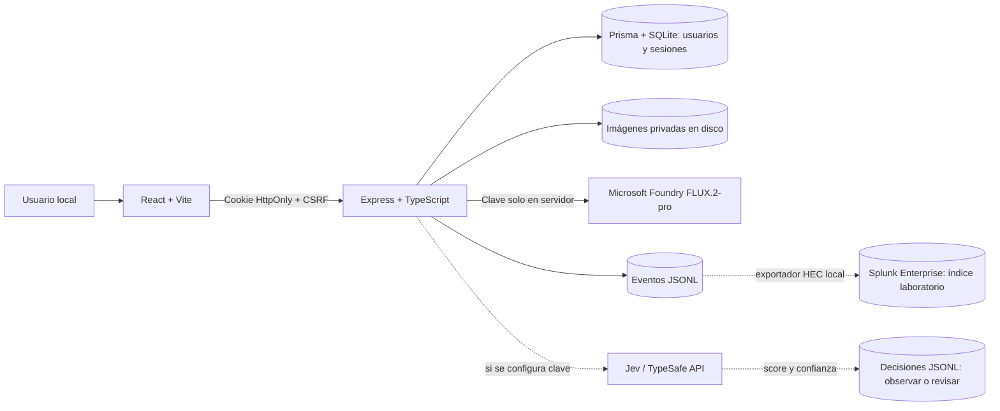

# Seguridad del laboratorio FLUX

## Alcance

Este proyecto se ejecuta como **laboratorio local**. El objetivo es demostrar controles reales en una aplicación de generación de imágenes y explicar cómo encajarían en una arquitectura empresarial como la de la VPN compartida por el usuario. Splunk Enterprise se integró en el equipo local mediante HEC. No se planea publicar el sitio ni desplegar WAF, VPN o IDS. Los componentes teóricos se distinguen de los implementados.

## Arquitectura que funciona hoy

Controles verificables: rutas privadas vinculadas al propietario; contraseñas con scrypt; sesión y CSRF; lista exacta de orígenes para cambios; límites de login y generación; autenticación antes de multipart; límite de 32 MP al decodificar y 4096 píxeles por lado al guardar; CSP y encabezados HTTP; errores de Foundry saneados; eventos con `request_id`. Jev evalúa fallos repetidos en modo observación cuando existe `TYPESAFE_API_KEY`. Su respuesta no bloquea usuarios automáticamente. El [contrato real de Jev](JEV_DECISION_CONTRACT.md) explica las preguntas tipadas y los umbrales.

Los límites de solicitudes viven en memoria y se reinician con el proceso. SQLite, las imágenes y los registros son locales. No hay respaldo ni retención automatizada. `NODE_ENV=production` tiene validación de HTTPS y cookie segura como control de código, pero no se necesita para ejecutar el laboratorio local.

## Relación con el diagrama empresarial

| Componente del diagrama | Equivalente o función en este laboratorio | Estado |
| --- | --- | --- |
| WebServer / aplicación | React y API Express que sirven el estudio de imágenes | Implementado localmente |
| Base de datos | SQLite con Prisma para cuentas, sesiones y metadatos | Implementado localmente |
| Firewall de aplicación / WAF | Filtrado y protección en el borde HTTP antes de Express | Teoría; no existe un WAF instalado |
| Firewall / subred privada | Separaría API, base de datos y almacenamiento en redes distintas | Teoría; en el laboratorio comparten equipo |
| VPN empresarial | Daría acceso administrativo remoto a recursos internos | Teoría; no hay acceso administrativo remoto |
| IDS / espejo de tráfico | Detectaría patrones de red que Express no puede ver | Teoría; no hay sensor de red |
| SIEM / Splunk | Recibe eventos JSONL y decisiones Jev mediante HEC local | Integrado y verificado en el índice `laboratorio` |
| Jev | Clasifica severidad de eventos repetidos con `score` y `confidence` | Código integrado; requiere clave TypeSafe para llamada real |
| Internet Gateway / TLS público | Expondría el servicio al exterior | Fuera del alcance de este laboratorio |

El flujo empresarial conceptual sería **cliente → WAF → aplicación → telemetría → SIEM → Jev → revisión humana**. La VPN se usaría para operadores, no para quienes generan imágenes. El flujo local implementado es **navegador → Express → JSONL → Splunk local**, con llamadas opcionales a Foundry y Jev. [Splunk](SPLUNK_EXPORT.md) se puede apagar cuando no se realiza la demostración.

## Escenarios de análisis para la demostración

1. Varios intentos de login fallidos producen eventos `auth.login_failed`. Tras tres fallos en diez minutos, Jev puede puntuar la severidad. La acción sigue siendo `observe` o `review`.
2. Una petición sin autorización a imágenes privadas obtiene rechazo; la prueba verifica que otro usuario no pueda descargar el archivo.
3. Una generación repetida alcanza el límite horario y devuelve 429; el evento se puede exportar al Splunk local mediante HEC.
4. Una imagen comprimida con dimensiones excesivas se rechaza antes de crear un PNG de gran tamaño.

Estos escenarios muestran defensa en la aplicación, trazabilidad y análisis de decisiones. No demuestran resistencia de red, inspección WAF ni operación de una VPN; esas partes se explican con el diagrama como extensión hipotética.
