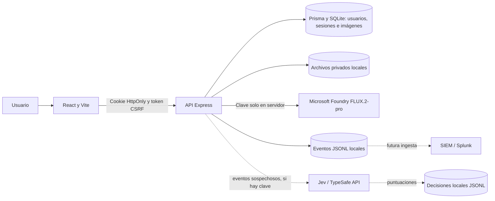

# Arquitectura de seguridad del estudio FLUX

## Estado verificable (24 de septiembre de 2026)

La imagen de VPN empresarial aportada por el usuario sirve como referencia de defensa en profundidad. Este proyecto es un estudio de generación de imágenes, por lo que su activo principal es la API de Foundry, las imágenes privadas, las cuentas y el costo de generación. No hay una VPN, WAF, proxy Squid, IDS ni Splunk operativos en este repositorio. Jev dispone de una integración opcional en modo observación.

## Controles implementados

- Sesiones con cookie HttpOnly, SameSite=Lax; token CSRF para operaciones autenticadas; hash de contraseña con scrypt.
- Propiedad de imágenes comprobada en las rutas privadas mediante usuario autenticado y base de datos.
- Lista exacta de orígenes para peticiones mutantes, encabezados de seguridad y CSP sin `unsafe-eval` ni scripts en línea. Los estilos en línea siguen permitidos para la interfaz actual.
- Autenticación antes de procesar archivos multipart; límites por archivo y por cantidad de partes.
- Límite horario configurable para generación, límites de acceso por IP y cuenta para login. Son límites en memoria por proceso: reinician al reiniciar y no coordinan varias instancias.
- Eventos de seguridad JSONL locales con `request_id`, resultado y etiquetas. No contienen prompts, credenciales, cookies ni contenido de imagen.
- Evaluación opcional con Jev de patrones de fallos; sólo genera recomendaciones de observación o revisión, sin bloqueos automáticos.
- Mensajes genéricos ante errores de parámetros devueltos por Foundry.

## Límites y riesgos pendientes

1. **Borde público:** TLS, WAF, protección DDoS, control de red y VPN administrativa dependen del despliegue. No son funciones de Express y no están configurados aquí. La VPN del diagrama correspondería al acceso administrativo, no al flujo público de clientes.
2. **Sesiones y límites:** SQLite y el rate limiter local requieren diseño de producción si se despliega en varias réplicas. El acceso público necesita HTTPS y `COOKIE_SECURE=true`.
3. **Telemetría:** `backend/data/security-events.jsonl` es local y está excluido de Git. Existe un [exportador opcional a Splunk HEC](SPLUNK_EXPORT.md), sin destino ni token configurados. Falta programarlo, monitorearlo y definir retención y acceso.
4. **Disponibilidad:** archivos e imágenes residen en disco local; faltan respaldo, almacenamiento compartido y política de cuotas por usuario.
5. **Secretos:** la credencial Foundry debe rotarse si fue expuesta en algún archivo previo, almacenarse en un gestor de secretos y jamás subirse a Git. No se ha verificado la rotación.
6. **Validación:** falta una prueba de despliegue real con TLS, proxy, WAF y el proveedor. La compilación y pruebas locales no certifican seguridad de producción.

## Fases siguientes

1. **Borde y operación:** fijar dominio, TLS, `APP_ORIGIN`, cookie segura, proxy de confianza controlado, WAF y límites compartidos; probar con el despliegue real.
2. **Visibilidad:** configurar el exportador HEC, definir retención, programar su ejecución y crear en Splunk paneles de login fallido, 403, 429, errores Foundry y volumen de generación. Alertas basadas en datos reales.
3. **Jev:** la integración inicial está en modo observación según [JEV_DECISION_CONTRACT.md](JEV_DECISION_CONTRACT.md). Calibrar con incidentes reales y revisión humana antes de aplicar bloqueos.

Cada fase debe tener commit y evidencia de prueba propios. No se debe activar una respuesta automática antes de medir falsos positivos y disponer de reversión.
